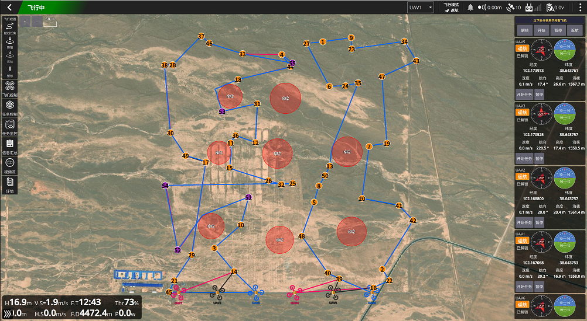

# GSTLBO — Data and Data-Generation Scripts

Data and generation scripts for the paper:

> **Structure-Guided Construction and Search for Heterogeneous UAV Swarm Cooperative Task Allocation with Temporal Task Chains**
> S. Wei, Z. Sun, Z. Wang, D. Kong, H. Mi, F. Liao, C. Huang — manuscript under review.



---

## Repository scope

This repository currently provides the data related to the paper and the scripts that generate them:

1. **Benchmark instances** used in the numerical experiments — `data/*.npz`
2. **HIL ground-station data** used in the hardware-in-the-loop experiments — `data/hil/`
3. **Data-generation scripts** — `scripts/`

The core source code of the proposed algorithm and of the compared baselines, together with the per-instance experimental results, will be released **after the paper is accepted**.

---

## Directory layout

```
.
├── README.md
├── data/
│   ├── n10_m3_randdepot_real.npz               # benchmark instances (21 files, see §1)
│   ├── n10_m3_nonuni_randdepot_real.npz
│   ├── n10_m3_randdepot_nfz_real.npz
│   └── hil/
│       └── ui_generated/                       # 30 HIL scenario files (see §2)
└── scripts/
    ├── gen_benchmark_data.py                   # numerical-experiment instances (§3.1)
    └── gen_data_ui.py                          # ground-station scenarios (§3.2)
```

---

## 1. Benchmark instances (`data/*.npz`)

Each `.npz` file stores **20 instances** of one problem scale for one experiment family. Files are loaded with `numpy.load` (no pickles required).

### Scales

The file tag `n{N}_m{M}` denotes **N targets** and **M UAVs**, using the same labels as in the paper:

| File tag    | Targets N | UAVs M | Paper label |
|-------------|-----------|--------|-------------|
| `n10_m3`    | 10  | 3  | M3-N10    |
| `n30_m6`    | 30  | 6  | M6-N30    |
| `n60_m12`   | 60  | 12 | M12-N60   |
| `n100_m16`  | 100 | 16 | M16-N100  |
| `n150_m24`  | 150 | 24 | M24-N150  |
| `n200_m32`  | 200 | 32 | M32-N200  |

### Families

| File pattern                        | Files | Experiment in the paper |
|-------------------------------------|-------|--------------------------|
| `n{N}_m{M}_randdepot_real.npz`         | 6 | Main comparison, time-budget and stability studies, ablation and controlled decomposition |
| `n{N}_m{M}_nonuni_randdepot_real.npz`  | 6 | Robustness on clustered (non-uniform) target layouts |
| `n{N}_m{M}_randdepot_nfz_real.npz`     | 5 | No-fly-zone extension under the Dubins metric (scales n30 – n200) |
| `n{N}_m{M}_randdepot_dyn_real.npz`     | 4 | Online replanning with dynamically appearing targets (n60 – n200) |

### Fields

`S` = number of instances (20), `N` = number of targets, `M` = number of UAVs. Each target has three ordered sub-tasks (*reconnaissance → strike → evaluation*); sub-task `k` (k = 0, 1, 2) of target `t` is stored at the flat index `3t + k` in the per-sub-task arrays.

| Key | Shape | Dtype | Meaning |
|-----|-------|-------|---------|
| `locs`                | (S, N, 2)   | float32 | Target positions in a local ENU frame, metres: `[east, north]` within a 1 km × 1 km area |
| `depot`               | (S, 2)      | float32 | Base position per instance (ENU metres); all UAVs share this base and return to it |
| `drone_types`         | (S, M)      | int64   | Capability type per UAV: `0` = reconnaissance, `1` = strike/combat, `2` = evaluation (types cycle over the fleet; the same stage order as the task chain) |
| `speed`               | (S, M)      | float32 | Cruise speed, m/s (15.0) |
| `turning_radii`       | (S, M)      | float32 | Minimum Dubins turning radius, m (30.0; 10.0 in the NFZ family) |
| `range_vals`          | (S, M)      | float32 | Flight-endurance budget per UAV, s (600 s = 10 min); when endurance is insufficient the UAV returns to base for a battery swap |
| `service_times`       | (S, N·3)    | float32 | On-target service time per sub-task, s (5.0; 0.0 in the NFZ family, where the Dubins orbit term πR/v accounts for the on-station time and a standalone service time would be double-counted) |
| `drone_capabilities`  | (S, 3, 3)   | bool    | Capability matrix by type: `[i, j] = 1` iff a UAV of type `i` can execute sub-task stage `j` (identity matrix — each type covers exactly one stage) |
| `nfz_centers`         | (S, 10, 2)  | float32 | Circular no-fly-zone centres (ENU metres); only the first `num_nfz` entries are valid per instance |
| `nfz_radii`           | (S, 10)     | float32 | No-fly-zone radii, m (≈ 40–60) |
| `num_nfz`             | (S,)        | int64   | Number of no-fly zones per instance |
| `dynamic_trigger_times` | (S, N·3)  | float32 | *(dynamic family only)* Appearance time (s) of each dynamically appearing target; non-zero only for the reconnaissance stage of the last ~10 % of targets |

### Data lineage

The four families are derived from a base set of fixed-base layouts (`n{N}_m{M}_real.npz`) through the scripts in §3.1. The base files are **not included in this repository**; they are available from the authors on request. The derivations are fully deterministic and documented by the scripts (seeds are embedded).

---

## 2. HIL ground-station data (`data/hil/`)

Mission files (`.plan`, UTF-8 JSON) used with the real ground control station during the hardware-in-the-loop experiments. The scenario files used in the paper are provided under `ui_generated/`.

### HIL scenario files (`ui_generated/`, 30 files)

Scenario files generated through the ground-station UI (via `gen_data_ui.py`). Each file is loaded by the ground station and contains the UAV fleet, the target set, the no-fly zones, and, when applicable, the dynamically appearing targets.

File-name convention, e.g. `d6_t60_sim6_t60-180_x1000_y1000_n8_r10_s42_00.plan`:

| Segment | Meaning |
|---------|---------|
| `d6` | Number of UAVs (6) |
| `t60` | Number of targets (60) |
| `sim6` | Number of dynamically appearing targets injected at runtime (6); absent when none |
| `t60-180` | Appearance-time window of the dynamic targets, s |
| `x1000_y1000` | Mission area, m × m |
| `n8` | Number of no-fly-zone (radar) circles requested |
| `r10` | Per-UAV flight-range budget, min (`max_range_s` = 600) |
| `s42` | Random seed |
| `_00` | Sample index |

The set covers five target-scale groups (30 / 40 / 50 / 60 / 80 targets) with varying no-fly-zone counts and dynamic-target settings. The two scales used in the paper's HIL experiments correspond to the six-UAV, 60- and 80-target groups (`d6_t60_*`, `d6_t80_*`). `sample_00.plan` is a compatibility copy kept by the generator (identical to one of the scenarios).

> **Note on the `drones` block.** When a scenario file is loaded by the ground station, only the per-UAV endurance budget `max_range_s` (= 600 s, 10 min) is consumed from the `drones` entries; the remaining drone fields (lat/lon/speed/ENU coordinates) are placeholder values written by an earlier version of the generator and are not used during loading. (The current `gen_data_ui.py` writes the drone entries from the UI configuration.) The operative content of each file is the target set, the no-fly zones and the dynamic-target definitions, all of which are internally consistent with the WGS84 reference point.

### `.plan` format

Full scenario files (`ui_generated/`):

```json
{
  "mission": {
    "reference": {"lat": …, "lon": …, "alt": …},
    "drones": [
      {"id": 0, "type": "recon | combat | eval", "speed": …,
       "lat": …, "lon": …, "alt": …, "max_range_s": …,
       "enu_x": …, "enu_y": …}
    ],
    "items": [
      {"polygon": [[lat, lon, alt], …],
       "radars": [{"lat": …, "lon": …, "radius": …}, …]}
    ],
    "sim_new_targets": [{"time": …, "lat": …, "lon": …, "alt": …}]
  }
}
```

- `reference` — WGS84 origin of the local ENU frame;
- `drones` — UAV fleet with per-UAV type, speed, WGS84 position and endurance budget;
- `items[0].polygon` — target waypoints (WGS84);
- `items[0].radars` — circular no-fly zones (radius in metres);
- `sim_new_targets` — dynamically appearing targets, injected at `time` (s) during execution;
- optional fields supported by the generator for special test modes: `sim_drone_failures` (simulated UAV failures) and `trigger_times` + `num_dynamic` (targets with release times).

---

## 3. Data-generation scripts (`scripts/`)

Both scripts are single-file and require only **Python 3.8+ and NumPy**.

### 3.1 Numerical-experiment instances — `gen_benchmark_data.py`

One script generates all four benchmark families. It reads the base layouts `data/n{N}_m{M}_real.npz` (not included, see §1) and writes the derived families into `data/`. With the default parameters the output is bit-for-bit identical to the released data.

| Subcommand | Produces | Notes |
|------------|----------|-------|
| `randdepot` | `n*_randdepot_real.npz` — main benchmark (randomly placed common base per instance) | default scales: all six |
| `nonuni` | `n*_nonuni_randdepot_real.npz` — clustered layouts (Gaussian-mixture clusters + ~10 % uniformly scattered targets) | default scales: all six |
| `nfz` | `n*_randdepot_nfz_real.npz` — NFZ family (turning radius 10 m; bases and targets resampled to keep clearance from the zones; service time set to 0) | default scales n30–n200; flags `--no-randdepot`, `--turning-radius`, `--service-time`, `--keep-service-time` |
| `dynamic` | `n*_randdepot_dyn_real.npz` — dynamic family (last 10 % of targets appear online at 100–300 s) | default scales n60–n200; flags `--n-dyn-frac`, `--seed`, `--t-min`, `--t-max` |

```bash
python scripts/gen_benchmark_data.py randdepot     # main benchmark
python scripts/gen_benchmark_data.py nonuni        # clustered layouts
python scripts/gen_benchmark_data.py nfz           # no-fly-zone family
python scripts/gen_benchmark_data.py dynamic       # dynamic-target family
python scripts/gen_benchmark_data.py all           # all four families, in order
```

`nfz` and `dynamic` derive from the `randdepot` family, so generate `randdepot` first when running them separately (`all` handles the order automatically). A `--data-dir` option overrides the default directory (`../data` relative to the script); it can be placed before or after the subcommand.

### 3.2 Ground-station scenarios — `gen_data_ui.py`

One self-contained script — the entry point invoked by the ground-station UI with a `saveTaskPoints` parameter file (see the script docstring for the parameter layout). It contains the target/no-fly-zone sampling, the WGS84 ↔ ENU conversion and the `.plan` writing utilities, and writes one scenario file per call.

```bash
python scripts/gen_data_ui.py <params.json>
```

Notes:

- Output is written relative to the script's own location (`scripts/test_data/ui_generated/`), and a `sample_00.plan` compatibility copy is produced alongside the parameter-tagged file name.
- The script parses the UI parameter layout exactly as written by the ground station (reference point; scenario sizes; sampling parameters; dynamic-target settings; UAV failure settings; per-UAV configuration). Drone entries are parsed from the 20th flat value onward, matching the UI layout.

---

## 4. Quick start

```bash
pip install numpy
```

```python
import numpy as np

# Load the M16-N100 main benchmark (20 instances)
d = np.load("data/n100_m16_randdepot_real.npz")
print(d.files)

locs   = d["locs"]    # (20, 100, 2)  target positions, ENU metres
depot  = d["depot"]   # (20, 2)       base position per instance
types  = d["drone_types"]   # (20, 16) 0/1/2 = reconnaissance/strike/evaluation
```

Inspect one HIL scenario file:

```python
import json

plan = json.load(open("data/hil/ui_generated/d6_t60_sim6_t60-180_x1000_y1000_n8_r10_s42_00.plan", encoding="utf-8"))
mission = plan["mission"]
print(len(mission["items"][0]["polygon"]))        # 60 targets
print(len(mission["items"][0]["radars"]))         # no-fly zones
print(len(mission.get("sim_new_targets", [])))    # dynamically appearing targets
```

---

## 5. Requirements

- Python 3.8+ with NumPy (all provided scripts).
- The benchmark regeneration scripts additionally require the base layout files (§1), which are available from the authors on request.

## 6. Contact

For questions, further data (base layouts, per-instance results), or collaboration, please open an issue in this repository.
